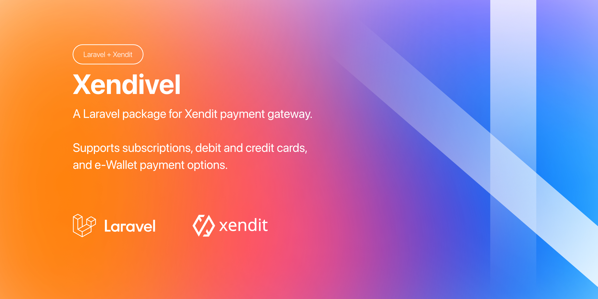
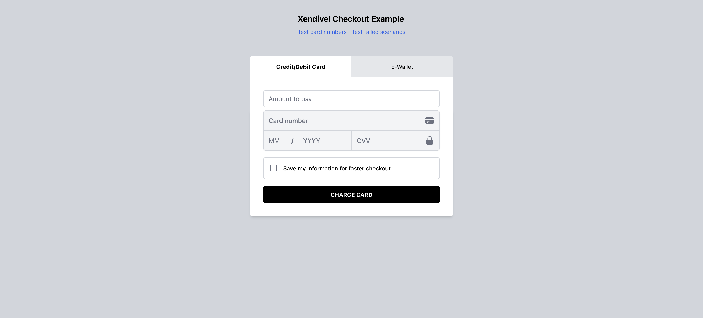
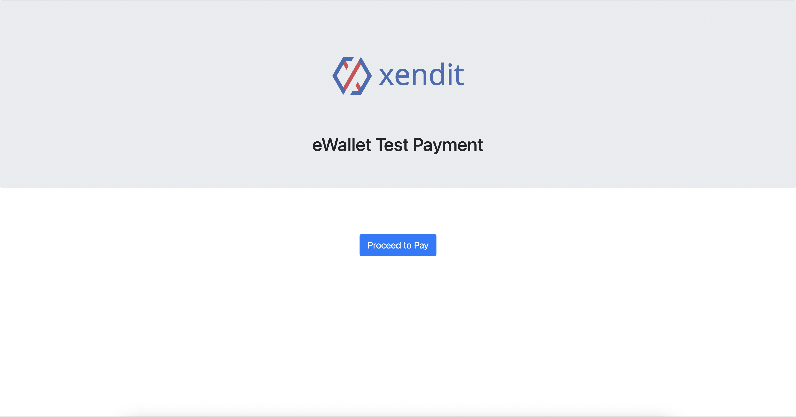
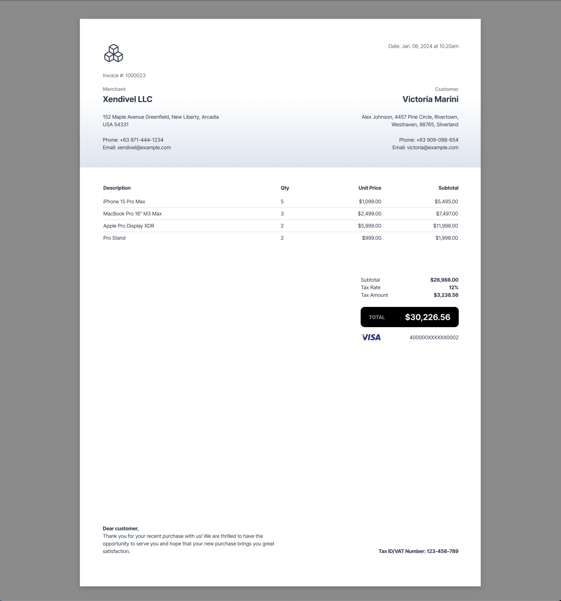
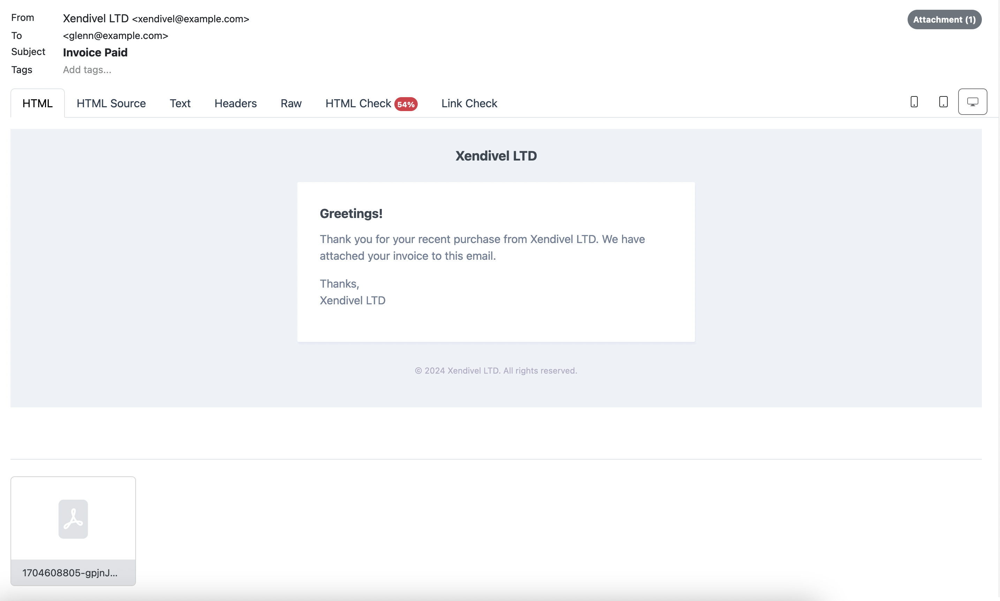

# Xendivel — A Laravel package for Xendit payment gateway

A Laravel package designed for seamless integration of Xendit payment gateway into your Laravel-powered applications or websites. It facilitates payments through credit cards, debit cards, and eWallets. Additionally, the package provides support for custom invoicing, queued invoice or refund email notifications, webhook event listeners and verification.

## Roadmap

The following features offered by Xendit are not currently included in this package but will be incorporated in future updates.

- Promotions (coupon/discount codes)
- Subscription services
- Real-time push notifications for payment status (PusherJS, WebSockets)
- Direct Bank Debits
- Disbursement APIs (for mass payment processing like employee payroll)
- PayLater
- QR Code payments

## Table of Contents

1. [Features](#features)
2. [Pre-requisites](#pre-requisites)
3. [Installation](#installation)
4. [Initial Setup](#initial-setup)
    - [Setup Xendit API keys](#setup-xendit-api-keys)
    - [Mail Driver Setup (Optional)](#mail-driver-setup)
    - [Jobs/Queues (Optional)](#job-queues)
    - [Webhook Setup](#webhook-setup)
    - [Configuration File](#configuration-file)
5. [Checkout Templates](#checkout-templates)
6. [Usage](#usage)
    - [Card Payments](#card-payments)
        - [Credit/Debit Card Tokenization](#card-details-tokenization)
        - [Charge Card](#charge-card)
        - [Get Card Charge](#get-card-charge)
        - [Multi-Use Card Token](#multi-use-card-token)
    - [eWallet Payments](#ewallet-payments)
        - [Charge eWallet](#charge-ewallet)
        - [Get eWallet Charge](#get-ewallet-charge)
        - [Void eWallet Charge](#void-ewallet-charge)
    - [PDF Invoicing](#pdf-invoicing)
        - [Generate PDF Invoice](#generate-pdf-invoice)
        - [Customizing PDF Invoice](#customizing-pdf-invoice)
        - [Sending PDF Invoice As Email Attachment](#sending-pdf-invoice-as-email-attachment)
        - [Queued Emails](#queued-emails)
    - [Refunds](#refunds)
        - [Card Payment Refund](#card-payment-refund)
        - [eWallet Payment Refund](#ewallet-payment-refund)
        - [Get Refund Details](#get-refund-details)
        - [List All Refunds](#list-all-refunds)
        - [Email Refund Notification](#email-refund-notifications)
    - [Webhook](#webhook)
        - [Listen to Webhook Event](#listen-to-webhook-event)
        - [Webhook Verification](#webhook-verification)
7. [Deploying to Production](#deploying-to-production)
8. [Tests](#tests)

## Features

- **Credit/Debit Cards** - Easily process payments through major credit or debit cards.
- **eWallet Payments** - Accepts a diverse range of eWallet payments based on your region (GCash, ShopeePay, PayMaya, GrabPay, etc.).
- **Custom Invoicing** - Provides built-in, highly customizable, and professional-looking invoice templates.
- **Queued Email Notifications** - Enables the use of markdown email templates and the option to schedule email notifications for background processing.
- **Webhooks** - Comes with built-in webhook event listeners from Xendit and ensures secure webhook verification.

### Pre-requisites

- PHP 8.0 or higher
- Laravel 9 or higher

## Installation

**Composer**

Xendivel utilizes Composer's package auto-discovery. All you need to do is to install Xendivel via composer and it will automatically register itself.

```bash
composer install glennraya/xendivel
```

## Initial Setup

### Xendit API Keys

Prior to using Xendivel, it's essential to have a Xendit account with properly configured API keys. Activation of your Xendit account for production is not necessary to test Xendivel's features. Test mode will be automatically enabled upon signing up for a Xendit account. Obtain your API keys from the following URLs:

- Secret Key/Public Key: https://dashboard.xendit.co/settings/developers#api-keys
- Webhook Verification Token: https://dashboard.xendit.co/settings/developers#webhooks

Generate `Money-In` `secret key` with `read` and `write` permissions from your dashboard API keys section.

After you acquired all these keys, please make sure you include them to your Laravel's `.env` file:

```ini
XENDIT_SECRET_KEY=your-secret-key
XENDIT_PUBLIC_KEY=your-public-key
XENDIT_WEBHOOK_VERIFICATION_TOKEN=your-webhook-verification-token
```

### Configure Laravel Mail (Optional)

Xendivel can send invoices to your customers as email attachments. To utilize this feature, ensure your [Laravel Mail](https://laravel.com/docs/10.x/mail#main-content)  is correctly set up. Before Xendivel dispatches invoice or refund email notifications, ensure your mail credentials are filled in your `.env` file.

```ini
MAIL_MAILER=smtp
MAIL_HOST=your-mailer-host
MAIL_PORT=your-mailer-port
MAIL_USERNAME=your-mailer-username
MAIL_PASSWORD=your-mailer-password
MAIL_ENCRYPTION=tls
MAIL_FROM_ADDRESS="fromaddress@example.com"
MAIL_FROM_NAME="${APP_NAME}"
```

### Jobs/Queues (Optional, but highly recommended)

Xendivel facilitates the queuing of email processes for background execution. If you intend to employ queued emails for tasks such as invoicing or refund notifications, ensure that you have properly configured Laravel's jobs/queues.

https://laravel.com/docs/10.x/queues#main-content

Then, make sure you have a queue worker running:

```bash
php artisan queue:work
```

Once you have successfully configured Laravel's queues, Xendivel is now capable of dispatching invoice or refund emails to the queue for background execution, enabling your app to respond to other requests or do other tasks without waiting for the emails to finish. This will improve overall user experience!

### Webhook Setup

Xendivel ships with built-in webhook event listeners. Whenever you create an eWallet charge, refund, or void payment, Xendivel will automatically respond to webhook events as well as verifying the webhook origin. You can publish Xendivel's webhook event listeners:

```php
php artisan vendor:publish --tag=xendivel-webhook-listener
```

The Events and Listeners files will be published under `app/Events` and `app/Listeners` respectively.

> Note: Xendivel will automatically verify the webhook callback origin, you don't need to do anything else so long as you supplied the XENDIT_WEBHOOK_VERIFICATION_TOKEN on your .env file.

After this, you should ensure that you setup a webhook URL from Xendit's dashboard under **eWallet Payment Status**:

https://dashboard.xendit.co/settings/developers#webhooks

The default endpoint for Xendivel webhook is `/xendit/webhook`. This is defined in Xendivel's config file `config/xendivel.php`.

Of course when defining webhook on Xendit, you should use absolute URL path (ex. https://your-domain.test/xendit/webhook) and your app should have `https` enabled.

When developing on your local machine, it's essential to make your local project accessible remotely. This can be achieved by utilizing localhost tunneling software such as [Ngrok](https://ngrok.com), [Expose](https://expose.dev), or any tool of your preference. The crucial aspect in this context is ensuring that your local project is reachable from external sources. This accessibility is crucial for Xendit to effectively send webhook callbacks to your application.

### Configuration File

Publish Xendivel's assets and configuration file to your Laravel application's config directory using the following command:

```bash
php artisan vendor:publish --tag=xendivel-config
```

Executing this command will publish Xendivel's config file to your Laravel app's config directory.

## Checkout Templates



Xendivel ships with a complete, fully working checkout template for cards and eWallet payments. The template include various variants such as **ReactJS component**, **ReactJS+TypeScript** component, and a regular **Blade** template and **VanillaJS**.

You can choose between the currently available template variants, you can even create your own.

### Example Checkout

Xendivel has a built-in route to preview the example checkout template (Blade). It's highly recommended to inspect the template as building the UI for checkout pages requires you to implement Xendit.js library for tokenization:

```
https://your-domain.test/xendivel/checkout/blade
```

> Note: Make sure you replace the `your-domain.test` with your own domain (whether local or production).

### Blade Template

We offer a standard Blade template for the checkout example, using VanillaJS. There's a built-in route allowing you to test this template at `/xendivel/checkout/blade`. You can access it through a URL like `https://your-domain.test/xendivel/checkout/blade`.

> NOTE: When you run the command `php artisan vendor:publish --tag=xendivel-views` the checkout blade template will be on your `/resources/views/vendor/xendivel/checkout.blade.php` directory.

### ReactJS + TypeScript component

Xendivel also have a checkout template component for **ReactJS** or **React+TypeScript** for those who are using front-end frameworks like React instead of regular Blade template.

```bash
php artisan vendor:publish --tag=xendivel-checkout-react-typescript

php artisan vendor:publish --tag=xendivel-checkout-react
```

These will be published under `/resources/js/vendor/xendivel/Checkout.tsx` for React+TypeScript or  `/resources/js/vendor/xendivel/Checkout.jsx` for plain ReactJS.

After publishing either one of these templates, please make sure you filled up the `public key` section on these React templates. Since this is a public key, it's perfectly safe to publish it directly on your templates.

```javascript
// Set your 'public' key here.
Xendit.setPublishableKey(
    'your-public-key',
)
```

These templates demonstrate card tokenization, credit/debit card, and eWallet payments. They serve to guide your payment collection process for implementation in your front-end stack. Alternatively, use them as fully functional standalone templates if you wish.

## Usage

### Credit/Debit Card Payments

#### About Credit/Debit Card Tokenization

Xendit employs a secure method for collecting credit or debit card details known as **tokenization**. The idea is instead of transmitting sensitive credit card information to your back-end, you utilize Xendit's JavaScript library to "tokenize" the card details before securely transmitting them to your back-end.

With this approach, there's no need to transmit your customer's card number, expiry date, and CVV (Card Verification Value) to the back-end for payment processing. Instead, these details are converted into secure **"tokens."** This ensures that even if leaked, your customer's credit/debit card information remains safe and confidential.

For more details, refer to Xendit's documentation below:

https://docs.xendit.co/credit-cards/integrations/tokenization

Xendivel provides convenient templates **(ReactJS, React+TypeScript, and Blade)** that serve as fully functional checkout components for card/eWallet payments, offering a solid starting point. Refer to the [Checkout templates](#checkout-templates) section for more details.

#### Charge Credit/Debit Cards

The `Xendivel::payWithCard` function accepts the incoming request payload with the `token_id`, `amount`, and `authentication_id`:

**Example Front-end POST Request from Axios**

```javascript
axios.post('/pay-with-card', {
    amount: 1200,
    token_id: 'card-token', // From card tokenization process.
    authentication_id: 'auth-id', // From authentication process.
    // Additional optional parameters:

    // external_id: 'your-custom-external-id',

    // descriptor: "Merchant Business Name",

    // currency: 'PHP',

    // metadata: {
    //     store_owner: 'Glenn Raya',
    //     nationality: 'Filipino',
    //     product: 'MacBook Pro 16" M3 Pro',
    //     other_details: {
    //         purpose: 'Work laptop',
    //         issuer: 'Xendivel LTD',
    //         manufacturer: 'Apple',
    //         color: 'Silver'
    //     }
    // }

    // billing_details: {
    //     given_names: 'Glenn',
    //     surname: 'Raya',
    //     email: 'glenn@example.com',
    //     mobile_number: '+639171234567',
    //     phone_number: '+63476221234',
    //     address:{
    //         street_line1: 'Ivory St. Greenfield Subd.',
    //         street_line2: 'Brgy. Coastal Ridge',
    //         city: 'Balanga City',
    //         province_state: 'Bataan',
    //         postal_code: '2100',
    //         country: 'PH'
    //     }
    // },
})
// ...
```

**Then, in your Laravel route or controller**

`POST` Request:

```php
use GlennRaya\Xendivel\Xendivel;

Route::post('/pay-with-card', function (Request $request) {
    $payment = Xendivel::payWithCard($request)
        ->getResponse();

    return $payment;
});
```

The JSON response would look like this:

```json
{
  "status": "CAPTURED",
  "authorized_amount": 5198,
  "capture_amount": 5198,
  "currency": "PHP",
  "metadata": {},
  "credit_card_token_id": "656ed874edab5300169c3092",
  "business_id": "6551f678273a62fd8d86e25a",
  "merchant_id": "104019905",
  "merchant_reference_code": "656ed874edab5300169c3091",
  "external_id": "43565633-dd58-47ae-bbe6-648f78d6652c",
  "eci": "02",
  "charge_type": "SINGLE_USE_TOKEN",
  "masked_card_number": "520000XXXXXX1005",
  "card_brand": "MASTERCARD",
  "card_type": "CREDIT",
  "ucaf": "AJkBBkhgQQAAAE4gSEJydQAAAAA=",
  "descriptor": "XDT*JSON FAKERY",
  "authorization_id": "656ed87c23f3c20015e2fb95",
  "bank_reconciliation_id": "7017631974056110603955",
  "issuing_bank_name": "PT BANK NEGARA INDONESIA TBK",
  "cvn_code": "M",
  "approval_code": "831000",
  "created": "2023-12-05T07:59:58.453Z",
  "id": "656ed87e23f3c20015e2fb96",
  "card_fingerprint": "61d6ed632aa321002350e0b2"
}

```

Xendit accepts optional parameters such as **`billing_details`**, **`metadata`**,  **`external_id`**, **`currency`**,  and **`descriptor`** as demonstrated in the Axios request above. You can refer to Xendit's documentation to learn more about these parameters:

https://developers.xendit.co/api-reference/#create-charge

> You can also forward an invoice in PDF format as an email attachment to your customer's email address. Details about this process are covered in the [PDF Invoicing](#pdf-invoicing) section.

#### Card Payment External ID
Xendit requires the inclusion of an `external_id` parameter in each credit/debit card charge. By default, Xendivel simplifies this process by generating a unique external ID using Ordered UUID v4 (https://laravel.com/docs/10.x/strings#method-str-ordered-uuid) automatically for you.

Nevertheless, if you opt to create your own `external_id` for some reason, you can achieve this by setting the `auto_id` option in the **xendivel.php** config file to **`false`**.

Config file: `config/xendivel.php`

```php
 'auto_id' => false,
```


Subsequently, ensure that you manually provide your custom `external_id` for each card charge request.

```javascript
axios.post('/pay-with-card', {
    amount: 1200,
    token_id: 'card-token', // From card tokenization process.
    authentication_id: 'auth-id', // From authentication process.
    external_id: 'your-custom-external-id', // Provide your own external id.
})
```

#### Get Card Charge Transaction

To retrieve the details of the card charge object, you must provide the **id** of the card charge (which should be sourced from your database or the Xendit dashboard) as the first parameter, and the string **card** as the second parameter.

`GET` Request:

```php
use GlennRaya\Xendivel\Xendivel;

Route::get('/payment', function () {
    // card charge id example: 659518586a863f003659b718
    $response = Xendivel::getPayment('card-charge-id', 'card')
        ->getResponse();

    return $response;
});
```

This endpoint will return a JSON response that shows important details like the `status` of the card charge, `charge_type`, `card_type`, `card_brand`, etc.

```json
{
  "created": "2020-01-08T04:49:08.815Z",
  "status": "CAPTURED",
  "business_id": "5848fdf860053555135587e7",
  "authorized_amount": 10000,
  "external_id": "test-pre-auth",
  "merchant_id": "xendit",
  "merchant_reference_code": "598942aabb91a4ec309e9a35",
  "card_type": "CREDIT",
  "masked_card_number": "400000XXXXXX0002",
  "charge_type": "SINGLE_USE_TOKEN",
  "card_brand": "VISA",
  "bank_reconciliation_id": "5132390610356134503009",
  "capture_amount": 9900,
  "descriptor": "My new store",
  "id": "659518586a863f003659b718"
}
```

#### Multi-Use Card Token

It's a common practice in e-commerce platforms to offer customers the convenience of saving their credit/debit card details for future use, eliminating the need for repetitive data entry during subsequent payments.

This functionality is achieved through the card tokenization process. If you've examined the [checkout templates](#checkout-templates) included with Xendivel, you'll find that this process has already been implemented for you.

Example JSON response for multi-use card token:

```json
{
  "status": "CAPTURED",
  "authorized_amount": 5198,
  "capture_amount": 5198,
  "currency": "PHP",
  "metadata": {},
  "credit_card_token_id": "65715e52689dc6001715bc57",
  "business_id": "6551f678273a62fd8d86e25a",
  "merchant_id": "104019905",
  "merchant_reference_code": "65715e530e502a00161aa2d9",
  "external_id": "f4270ddb-650d-4973-8786-1f5b4c048c76",
  "eci": "02",
  "charge_type": "MULTIPLE_USE_TOKEN",
  "masked_card_number": "520000XXXXXX1005",
  "card_brand": "MASTERCARD",
  "card_type": "CREDIT",
  "ucaf": "AJkBBkhgQQAAAE4gSEJydQAAAAA=",
  "descriptor": "XDT*JSON FAKERY",
  "authorization_id": "65715e5d689dc6001715bc5b",
  "bank_reconciliation_id": "7019285426096226603954",
  "issuing_bank_name": "PT BANK NEGARA INDONESIA TBK",
  "cvn_code": "M",
  "approval_code": "831000",
  "created": "2023-12-07T05:55:43.603Z",
  "id": "65715e5f689dc6001715bc60",
  "card_fingerprint": "61d6ed632aa321002350e0b2"
}

```
**Note:** When `charge_type` is `MULTIPLE_USE_TOKEN`, you should make sure that you save the `credit_card_token_id` to your database. You will use this token to charge the card again in the future without re-entering the card details again.

### eWallet Payments
Xendivel is compatible with all eWallet payment channels supported by Xendit. For further details, refer to the documentation at https://docs.xendit.co/ewallet, and explore Xendit's API reference at https://developers.xendit.co/api-reference/#create-ewallet-charge.

#### Charge eWallet

Example Axios post request:

```javascript
axios
    .post('/pay-via-ewallet', {
        // You can test different failure scenarios by using the 'magic amount' from Xendit.
        amount: parseInt(amount),
        currency: 'PHP',
        checkout_method: 'ONE_TIME_PAYMENT',
        channel_code: 'PH_GCASH',
        channel_properties: {
            success_redirect_url:
                'https://your-domain.test/ewallet/success',
            failure_redirect_url: 'https://your-domain.test/ewallet/failed',
        },
    })
    .then(response => {
        // Upon successful request, you will be redirected to the eWallet's checkout url.
        console.log(response.data)
        window.location.href =
            response.data.actions.desktop_web_checkout_url
    })
    /// ...
```

Then, on your Laravel route or controller:

`POST` Request:

```php
use GlennRaya\Xendivel\Xendivel;

Route::post('/pay-via-ewallet', function (Request $request) {
    $response = Xendivel::payWithEwallet($request)
        ->getResponse();

    return $response;
});
```

In the example Axios request above you will be redirected to the eWallet payment provider's checkout page to complete the payment authorization there. If you are on development mode, you will see something like this:




The resulting JSON response would look like this:

```json
{
    "created": "2023-12-09T07:51:17.926Z",
    "business_id": "6551f678273a62fd8d86e25a",
    "event": "ewallet.capture",
    "data": {
        "id": "ewc_5b2ad2c6-11a3-410a-b5ab-b41d16e39879",
        "basket": null,
        "status": "SUCCEEDED",
        "actions": {
            "qr_checkout_string": null,
            "mobile_web_checkout_url": "https://ewallet-mock-connector.xendit.co/v1/ewallet_connector/checkouts?token=clq1oqg032dn7a8hko1g",
            "desktop_web_checkout_url": "https://ewallet-mock-connector.xendit.co/v1/ewallet_connector/checkouts?token=clq1oqg032dn7a8hko1g",
            "mobile_deeplink_checkout_url": null
        },
        "created": "2023-12-09T07:51:06.63582Z",
        "updated": "2023-12-09T07:51:17.780894Z",
        "currency": "PHP",
        "customer": null,
        "metadata": null,
        "voided_at": null,
        "capture_now": true,
        "customer_id": null,
        "void_status": null,
        "callback_url": "https://pktuw9nrxn.sharedwithexpose.com/xendit/webhook",
        "channel_code": "PH_GCASH",
        "failure_code": null,
        "reference_id": "90c0c5f5-c6f0-4f2e-bf6c-f23763911f8a",
        "charge_amount": 1000,
        "capture_amount": 1000,
        "checkout_method": "ONE_TIME_PAYMENT",
        "refunded_amount": null,
        "payment_method_id": null,
        "channel_properties": {
            "failure_redirect_url": "https://package.test/ewallet/failed",
            "success_redirect_url": "https://package.test/ewallet/success"
        },
        "is_redirect_required": true,
        "payer_charged_amount": null,
        "shipping_information": null,
        "payer_charged_currency": null
    },
    "api_version": null
}

```

Upon the successful completion of the payment, you will be seamlessly redirected to the designated success or failure page URL as specified in your axios request parameters (`success_redirect_url` or `failure_redirect_url`).

#### Responding to eWallet Charge Webhook Event

By default, Xendivel will listen to `xendit/webhook` URL for callbacks as defined in Xendivel's config file whenever you make an eWallet charge, refund, or void transactions. You have the option to change the default webhook URL if you prefer:

`config/xendivel.php`

```php
'webhook_url' => '/xendit/webhook', // You can change this to whatever you like.
```

Then, after you published Xendivel's webhook event listeners from [here](#webhook-setup), you can now respond to the callback event from Xendit after a successful eWallet charge from the webhook listener located in `app/Listener/eWalletWebhookListener.php`:

```php
public function handle(eWalletEvents $event)
{
    // You can inspect the returned data from the webhoook in your logs file
    // storage/logs/laravel.log
    logger('Webhook data received: ', $event->webhook_data);

    // if($event->webhook_data['data']['status'] === 'SUCCEEDED') {
    //     $invoice_data = [
    //         // Invoice data...
    //     ];

    //     $email_invoice = new Xendivel();
    //     $email_invoice->emailInvoiceTo('glenn@example.com', $invoice_data)
    //         ->send();
    // }
}
```

You can now perform other tasks based on the payload of the callback such as interacting with your database, call other APIs, send an email, etc.

#### Get eWallet Charge

Fetch the details of an eWallet charge. The `Xendivel::getPayment` function accepts the **eWallet charge ID** as the first parameter, and the type of charge which is **ewallet** as the second parameter.

`GET` Request:

```php
use GlennRaya\Xendivel\Xendivel;

Route::get('/get-ewallet-charge', function (Request $request) {
	$response = Xendivel::getPayment('ewc_65cbfb33-a1ea-4c32-a6f3-6f8202de9d6e', 'ewallet')
			->getResponse();

	return $response;
});
```

The JSON response would look similar to this:

```json
{
  "id": "ewc_bb8c3po-c3po-r2d2-c3po-r2d2c3por2d2",
  "business_id": "5f218745736e619164dc8608",
  "reference_id": "test-reference-id",
  "status": "PENDING",
  "currency": "IDR",
  "charge_amount": 1000,
  "capture_amount": 1000,
  "refunded_amount": null,
  "checkout_method": "ONE_TIME_PAYMENT",
  "channel_code": "ID_SHOPEEPAY",
  "channel_properties": {
    "success_redirect_url": "https://dashboard.xendit.co/register/1"
  },
  "actions": {
    "desktop_web_checkout_url": null,
    "mobile_web_checkout_url": null,
    "mobile_deeplink_checkout_url": "https://deeplinkcheckout.this/",
    "qr_checkout_string": "ID123XenditQRTest321DI"
  },
  "is_redirect_required": true,
  "callback_url": "https://calling-back.com/xendit/shopeepay",
  "created": "2017-07-21T17:32:28Z",
  "updated": "2017-07-21T17:32:28Z",
  "void_status": null,
  "voided_at": null,
  "capture_now": true,
  "customer_id": null,
  "payment_method_id": null,
  "failure_code": null,
  "basket": null,
  "metadata": {
    "branch_code": "tree_branch"
  }
}
```

#### Void eWallet Charge

`POST` Request:

```php
use GlennRaya\Xendivel\Xendivel;

Route::post('/ewallet/void', function(Request $request) {
    // Example eWallet charge ID: ewc_e743d499-baa1-49f1-96c0-cc810890739b
    $response = Xendivel::void($request->ewallet_charge_id)
        ->getResponse();

    return $response;
});
```

With this Void API, you can nullify a successfully processed eWallet payment, ensuring that the entire original amount is refunded to the end user.

Voiding an eWallet charge is defined as the cancellation of eWallet payments created within the same day and before the **cutoff time of 23:50:00 (UTC+07:00 for Indonesia eWallets/ UTC+08:00 for Philippines eWallets)**.

-   Void API will only work for charges created via the `/ewallets/charges` API with `SUCCEEDED` status
-   Void API will return `PENDING` `void_status` in API response upon execution. A follow-up webhook will be sent to your system's URL when void has been processed successfully.

**To cancel eWallet payments after the aforementioned cutoff time, the [Refund API](#ewallet-payment-refund) should be used.**

### PDF Invoicing



Xendivel has the ability to generate professional and customizable PDF Invoices. You can preview the default invoice template by going to the route `/xendivel/invoice/template`.

```
https://your-domain.test/xendivel/invoice/template
```

**Note:** Remember to replace the `your-domain.test` with your domain.

PDF invoices are generated using standard **Laravel Blade** templates and Xendivel will convert this to PDF invoice for you. Since invoices are just regular Blade templates, you can pass data to the template just like you would on a [Laravel Blade](https://laravel.com/docs/10.x/blade#displaying-data) file.

#### Generate PDF Invoice

```php
use GlennRaya\Xendivel\Invoice;

Route::get('/xendivel/invoice/generate', function () {
    $invoice_data = [
        'invoice_number' => 1000023,
        'card_type' => 'VISA',
        'masked_card_number' => '400000XXXXXX0002',
        'merchant' => [
            'name' => 'Xendivel LLC',
            'address' => '152 Maple Avenue Greenfield, New Liberty, Arcadia USA 54331',
            'phone' => '+63 971-444-1234',
            'email' => 'xendivel@example.com',
        ],
        'customer' => [
            'name' => 'Victoria Marini',
            'address' => 'Alex Johnson, 4457 Pine Circle, Rivertown, Westhaven, 98765, Silverland',
            'email' => 'victoria@example.com',
            'phone' => '+63 909-098-654',
        ],
        'items' => [
            ['item' => 'iPhone 15 Pro Max', 'price' => 1099, 'quantity' => 5],
            ['item' => 'MacBook Pro 16" M3 Max', 'price' => 2499, 'quantity' => 3],
            ['item' => 'Apple Pro Display XDR', 'price' => 5999, 'quantity' => 2],
            ['item' => 'Pro Stand', 'price' => 999, 'quantity' => 2],
        ],
        'tax_rate' => .12,
        'tax_id' => '123-456-789',
        'footer_note' => 'Thank you for your recent purchase with us! We are thrilled to have the opportunity to serve you and hope that your new purchase brings you great satisfaction.',
    ];

    return Invoice::make($invoice_data)
        ->save();
});
```

As you can see, the `Invoice::make` function accepts an associative array that contains the information you want to appear in the invoice, typically coming from your database. By default, it will be saved in the `/storage/app/invoices` directory of your Laravel app. You can change the location where you want to save your invoices by modifying the `invoice_storage_path` option in your Xendivel config file.

```
'invoice_storage_path' => storage_path('/app/invoices/')
```

#### Download PDF Invoice

You can immediately download the invoice to your customer's local machine instead of storing it your Laravel app's storage directory by calling the `Invoice::download` function:

```php
use GlennRaya\Xendivel\Invoice;

Route::get('/xendivel/invoice/download', function () {
    $invoice_data = [
        // Invoice data...
    ];

    return Invoice::download($invoice_data);
});
```

#### Invoice Paper Size

By default, Xendivel will generate PDF invoices in standard **Letter** paper size. Xendivel supports the following sizes:

```
Letter: 8.5in  x  11in
Legal: 8.5in  x  14in
Tabloid: 11in  x  17in
Ledger: 17in  x  11in
A0: 33.1in  x  46.8in
A1: 23.4in  x  33.1in
A2: 16.54in  x  23.4in
A3: 11.7in  x  16.54in
A4: 8.27in  x  11.7in
A5: 5.83in  x  8.27in
A6: 4.13in  x  5.83in
```

#### Change Invoice Paper Size

You can change the invoice size by invoking the `paperSize()` function when generating or downloading an invoice and specify the name of the paper size as the parameter:

```php
use GlennRaya\Xendivel\Invoice;

Route::get('/xendivel/invoice/download', function () {
    $invoice_data = [
        // Invoice data...
    ];

    return Invoice::make($invoice_data)
        ->paperSize('A4')
        ->download();
});
```

In this example, we can modify the invoice's paper size by invoking the `paperSize('A4')` function and indicating the desired paper size as its parameter.

#### Change Invoice Orientation

You can also change the orientation of the invoice, by default it's on `portrait`. You can change this to `landscape` by using the `orientation()` function:

```php
use GlennRaya\Xendivel\Invoice;

Route::get('/xendivel/invoice/download', function () {
    $invoice_data = [
        // Invoice data...
    ];

    return Invoice::make($invoice_data)
        ->paperSize('A4')
        ->orientation('landscape')
        ->download();
});
```

#### Invoice Filename

Whenever Xendivel generates, downloads or email an invoice to your customers, Xendivel will assign a unique filename using UUID v4 and appending the `-invoice.pdf` at the end of the filename. Here's an example:

```
c7ff9fa5-b629-4fc9-8e61-bd203c91ca65-invoice.pdf
```

If you want to customize the filenaming convention of Xendivel, you can easily do so by using the `fileName()` function of the `Invoice` class:

```php
use GlennRaya\Xendivel\Invoice;

Route::get('/xendivel/invoice/download', function () {
    $invoice_data = [
        // Invoice data...
    ];

    return Invoice::make($invoice_data)
        ->paperSize('A4')
        ->orientation('landscape')
        ->fileName('my-awesome-invoice-filename')
        ->download();
});
```

Now the generated invoice will have a filename that looks like:

```
my-awesome-invoice-filename-invoice.pdf
```

#### Customizing PDF Invoice Template

As previously mentioned, the PDF invoice template is essentially a standard **Laravel Blade** component. This implies that it is a conventional HTML/PHP file styled with [TailwindCSS](https://tailwindcss.com). Consequently, the task of adjusting both the styles and contents of the invoice is exceptionally straightforward, it's just like working on a regular HTML file.

Publish the invoice template to your `views` directory:

```bash
php artisan vendor:publish --tag=xendivel-invoice
```

This command will publish the `invoice.blade.php` to your `resources/views/vendor/xendivel` directory. Upon inspecting the file, you will notice the `$invoice_data` variable. This variable contains the associative array that you passed to the view from previous examples.

Example section from the invoice template where the list of purchases was listed:

```php
{{-- Other data... --}}
<table class="border-collapse w-full">
    <thead>
        <tr class="text-left">
            <th class="pb-2">Description</th>
            <th class="pb-2">Qty</th>
            <th class="pb-2 text-right">Unit Price</th>
            <th class="px-0 pb-2 text-right">Subtotal</th>
        </tr>
    </thead>
    <tbody class="divide-y divide-gray-200">
        @php
            $total_price = 0;
        @endphp
        @foreach ($invoice_data['items'] as $item)
            @php
                $total_price += $item['price'] * $item['quantity'];
            @endphp
            <tr>
                <td class="py-1">{{ $item['item']}}</td>
                <td class="py-1">{{ $item['quantity'] }}</td>
                <td class="py-1 text-right">${{ number_format($item['price'], 2) }}</td>
                <td class="py-1 text-right">
                    ${{ number_format($item['price'] * $item['quantity'], 2) }}
                </td>
            </tr>
        @endforeach
    </tbody>
</table>
{{-- Other data... --}}
```

Since this is just a regular HTML/Blade template, there's no limit to the customizations you can make. You can define your own styles, modify the data being rendered, and even add images to the template. Xendivel will automatically convert this template into a PDF file upon generation, downloading, or when sent via email attachment.

#### Sending PDF Invoice As Email Attachment

It's a common practice that, following a purchase on an e-commerce website or app, customers receive an email detailing their transaction, accompanied by an attached invoice. Xendivel makes it easy to send an invoice to your customers after completing the purchase.

#### Sending PDF Invoice For Card Payment

```php
use GlennRaya\Xendivel\Xendivel;

Route::post('/checkout-email-invoice', function (Request $request) {
    $invoice_data = [
        'invoice_number' => 1000023,
        'card_type' => 'VISA',
        'masked_card_number' => '400000XXXXXX0002',
        'merchant' => [
            'name' => 'Stark Industries',
            'address' => '152 Maple Avenue Greenfield, New Liberty, Arcadia USA 54331',
            'phone' => '+63 971-444-1234',
            'email' => 'xendivel@example.com',
        ],
        'customer' => [
            'name' => 'Mr. Glenn Raya',
            'address' => 'Alex Johnson, 4457 Pine Circle, Rivertown, Westhaven, 98765, Silverland',
            'email' => 'victoria@example.com',
            'phone' => '+63 909-098-654',
        ],
        'items' => [
            ['item' => 'MacBook Pro 16" M3 Max', 'price' => $request->amount, 'quantity' => 1],
        ],
        'tax_rate' => .12,
        'tax_id' => '123-456-789',
        'footer_note' => 'Thank you for your recent purchase with us! We are thrilled to have the opportunity to serve you and hope that your new purchase brings you great satisfaction.',
    ];

    $payment = Xendivel::payWithCard($request)
        ->emailInvoiceTo('glenn@example.com', $invoice_data)
        ->send()
        ->getResponse();

    return $payment;
});
```

The `emailInvoiceTo` function accepts the email address where you want to send the invoice as the first parameter, and the `$invoice_data` that holds the details about the invoice as the second parameter. The `send()` function will instruct Xendivel to actually send the email.

#### Email Subject and Message



The above image is an example of the email with the PDF invoice attached that Xendivel will send by default. You can customize the subject and the email message itself:

#### Customize Subject

To change the default email's subject, you can use the `subject()` function:

```php
use GlennRaya\Xendivel\Xendivel;

Route::post('/checkout-email-invoice', function (Request $request) {
    $invoice_data = [
        // Invoice data...
    ];
    $payment = Xendivel::payWithCard($request)
        ->emailInvoiceTo('glenn@example.com', $invoice_data)
        ->subject('Thank you for your purchase!')
        ->send()
        ->getResponse();
    });
```

#### Customize Message
To change the default email's message, you can use the `message()` function:

```php
use GlennRaya\Xendivel\Xendivel;

Route::post('/checkout-email-invoice', function (Request $request) {
    $invoice_data = [
        // Invoice data...
    ];
    $payment = Xendivel::payWithCard($request)
        ->emailInvoiceTo('glenn@example.com', $invoice_data)
        ->subject('Thank you for your purchase!')
        ->message('We appreciate your business and look forward to serving you again. We have attached your invoice.')
        ->send()
        ->getResponse();
});
```
